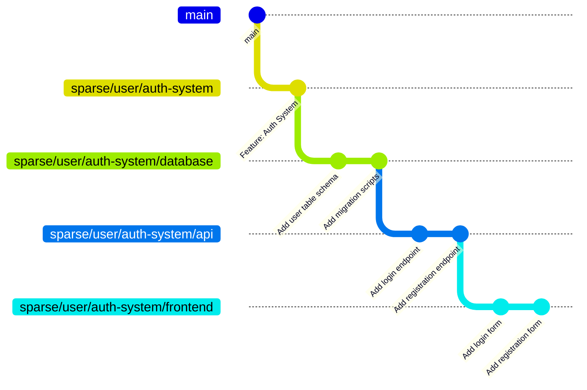
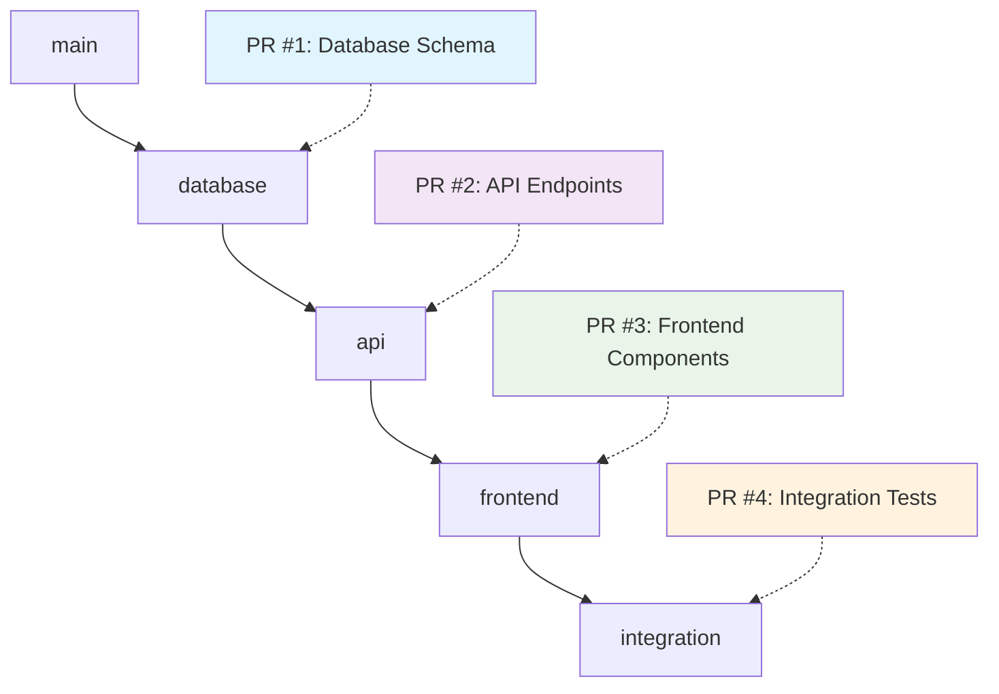
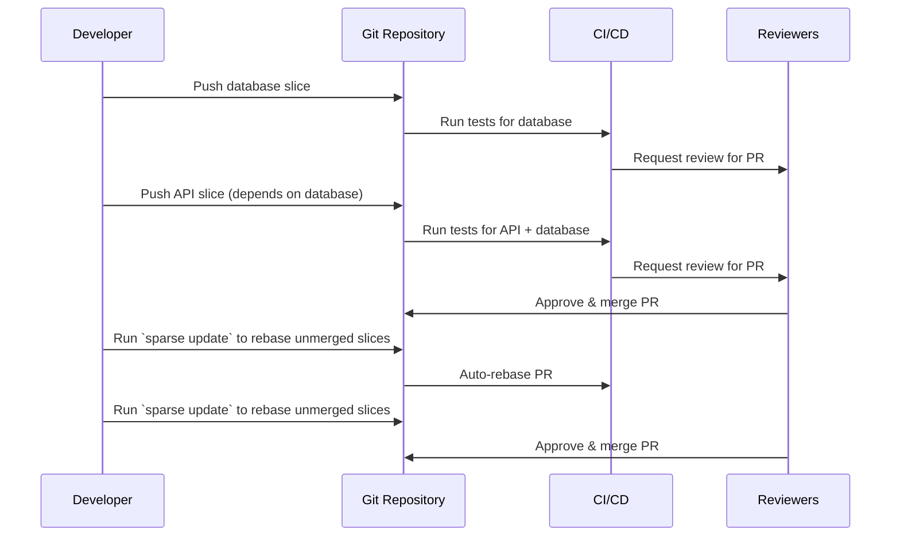

# 🌳 Sparse - Stacked PR Workflow Made Simple

`sparse` is a powerful command-line tool that transforms how you work with Git by enabling elegant **stacked pull request** workflows. Break down complex features into smaller, manageable, and reviewable chunks while maintaining clear dependencies between them.

## 🚀 Why Stacked PRs?

Traditional development often leads to massive PRs that are:
- 🔍 **Hard to review** - Reviewers get overwhelmed by large changesets
- ⏰ **Slow to merge** - Complex changes take longer to get approved
- 🐛 **Risky to deploy** - Large changes increase the chance of bugs
- 🔄 **Difficult to iterate** - Feedback on one part blocks the entire feature

**Stacked PRs solve this by:**
- 📦 Breaking features into logical, atomic changes
- 🔗 Maintaining clear dependencies between related changes
- ⚡ Enabling parallel development and review
- 🎯 Making each PR focused and purposeful

## 📊 How Sparse Works

Sparse creates a structured branching system that mirrors your feature's logical breakdown:



Each branch (called a "slice") represents a focused PR:
1. **Database slice**: Schema changes and migrations
2. **API slice**: Backend authentication endpoints
3. **Frontend slice**: User interface components

## 🛠 Installation

### Prerequisites
- **Git** must be installed and available in your `PATH`
- **Zig** (for building from source)

### Building from Source
```bash
git clone <repository-url>
cd sparse
zig build
```

The binary will be available at `zig-out/bin/sparse`.

## 🎯 Quick Start

### 1. Create Your First Feature
```bash
# Start a new feature targeting the main branch
sparse feature auth-system --to main

# Or create a feature with an initial slice
sparse feature auth-system database --to main
```

### 2. Work and Create Slices
```bash
# Make some changes for your database layer
git add .
git commit -m "Add user table schema"

# Create a new slice for API work
sparse slice api
sparse status # to check dont be afraid to run this
sparse update # to update the slices in remote this does force-with-lease use with caution and make sure status doesnt report corruption

# Continue development...
git add .
git commit -m "Add authentication endpoints"

# Create another slice for frontend
sparse slice frontend
git add .
git commit -m "Add login components"
```

### 3. Check Your Progress
```bash
sparse status
```

This shows a beautiful overview of your feature:
```
┌─ Sparse Feature Status
│
├─ 🎯 Active Feature: auth-system
│
├─ 📊 Slice Analysis:
│  ✓ Orphan slices: 1 (ideal: 1)
│  ✓ Forked slices: 0 (ideal: 0)
│
├─ 🎯 Target Branch: main
│
├─ 🌳 Slice Graph:
│
│  ├─ 🍃 frontend ↓ api
│  ├─ 🔸 api ↓ database
│  └─ 🌱 database → main
│
├─ 🔄 Merge Status:
│  ✗ database: not merged
│  ✗ api: not merged
│  ✗ frontend: not merged
│
├─ 📈 Summary:
│  📊 Total slices: 3
│  ✅ Merged: 0 / 3
│  🔄 Pending: 3
│
└─ ✨ Status complete
```

## 📚 Commands Reference

### `sparse feature`
Create or switch to a feature branch.

```
sparse feature [ options ] <feature_name> [<slice_name>]

args:
<feature_name>: name of the feature to be created. If a feature with the same name
                exists, sparse simply switches to that feature.
<slice_name>:   name of the first slice in newly created feature. This
                argument is ignored if the feature already exists.

options:
--to <branch>: branch to build on top. Pull requests for the new
               feature will target this branch. (default: main)
-h, --help:    shows this help message.
```

**Examples:**
```bash
# Create a new feature
sparse feature user-dashboard --to main

# Create feature with initial slice
sparse feature payment-flow checkout --to develop

# Switch to existing feature
sparse feature user-dashboard
```

### `sparse slice`
Create or switch to a slice within the current feature.

```
sparse slice [ options ] [<slice_name>]

args:
<slice_name>: name of the new slice in feature.
                If the slice with the same name exists, then sparse switches to that slice.
                If <slice_name> is not provided, then sparse creates the slice based on the number of slices currently in the feature.

options:
-h, --help:    shows this help message.
```

**Examples:**
```bash
# Create auto-numbered slice
sparse slice

# Create named slice
sparse slice validation

# Switch to existing slice
sparse slice database
```

### `sparse status`
Show comprehensive status of the current feature.

```
sparse status [ options ]

Show status information for current feature

options:
-h, --help:    shows this help message.
```

**Displays:**
- 📊 Slice analysis and health checks
- 🌳 Visual slice dependency graph
- 🔄 Merge status for each slice
- 📈 Summary statistics

### `sparse update`
Update and rebase all slices in the current feature.

```
sparse update [ options ] [<slice_name>]

Update all slices in current feature

options:
--continue:    continue updating after fixing merge conflicts
-h, --help:    shows this help message.
```

## 🎨 Real-World Example

Let's walk through building a complete user authentication system:

### Step 1: Initialize the Feature
```bash
sparse feature auth-system --to main
```

### Step 2: Database Layer
```bash
# Work on database schema
git add migrations/001_create_users.sql
git commit -m "Add users table with email and password fields"

git add models/user.js
git commit -m "Add User model with validation"
# you can either use git push or
# sparse update to push changes to remote
git push
# make sure to run sparse status whenever you feel like it
```

### Step 3: API Layer
```bash
sparse slice api

git add routes/auth.js
git commit -m "Add POST /login and /register endpoints"

git add middleware/auth.js
git commit -m "Add JWT authentication middleware"
```

### Step 4: Frontend Layer
```bash
sparse slice frontend

git add components/LoginForm.jsx
git commit -m "Add login form component"

git add components/RegisterForm.jsx
git commit -m "Add registration form component"
```

### Step 5: Integration
```bash
sparse slice integration

git add tests/auth.integration.test.js
git commit -m "Add end-to-end authentication tests"
```

### Result: Clean Stack Structure


## 💡 Best Practices

### 🎯 Slice Organization
- **Keep slices focused**: Each slice should have a single responsibility
- **Logical dependencies**: Ensure slices build on each other naturally
- **Reasonable size**: Aim for 50-300 lines changed per slice

### 🔄 Workflow Tips
- **Regular status checks**: Use `sparse status` to visualize your progress
- **Descriptive commits**: Each commit should clearly describe its purpose
- **Test each slice**: Ensure each slice is functional on its own

### 🚀 PR Strategy


## 🏗 Branch Structure

Sparse uses a consistent naming convention:

```
sparse/<user.email>/<feature-name>/<slice-name>
```

**Example:**
```
sparse/jane.doe@company.com/user-dashboard/
├── database          # Database schema changes
├── api               # Backend API endpoints
├── frontend          # UI components
└── integration       # End-to-end tests
```

## 🤝 Team Collaboration

### Handling Updates
```bash
# When main branch gets updated
sparse update

# If conflicts occur
# ... resolve conflicts manually ... and then
sparse update --continue
```

## 🛡 Error Handling & Recovery

Sparse provides helpful diagnostics:

### Orphan Slices Detection
```bash
sparse status
# Shows warnings if slice structure is corrupted
```

### Conflict Resolution
```bash
sparse update
# If conflicts occur, sparse pauses for manual resolution
git add resolved-files.js
git rebase --continue
sparse update --continue
```

## 🎁 Benefits for Your Team

### 👥 For Reviewers
- **Focused reviews**: Each PR has a clear, limited scope
- **Faster turnaround**: Smaller changes = quicker reviews
- **Better context**: Logical progression through the feature

### 🔧 For Developers
- **Parallel work**: Multiple team members can work on different slices
- **Early feedback**: Get feedback on foundational changes before building on top
- **Easier debugging**: Issues are isolated to specific slices

### 🚀 For Teams
- **Faster delivery**: Features ship incrementally
- **Reduced risk**: Smaller changes mean fewer bugs
- **Better planning**: Clear breakdown of feature complexity

---

## 📄 License

This project is licensed under the [LICENSE](LICENSE) file in the repository.
