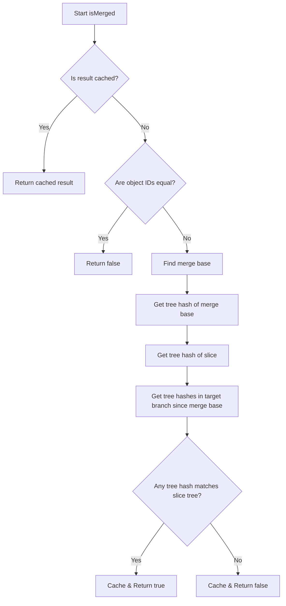
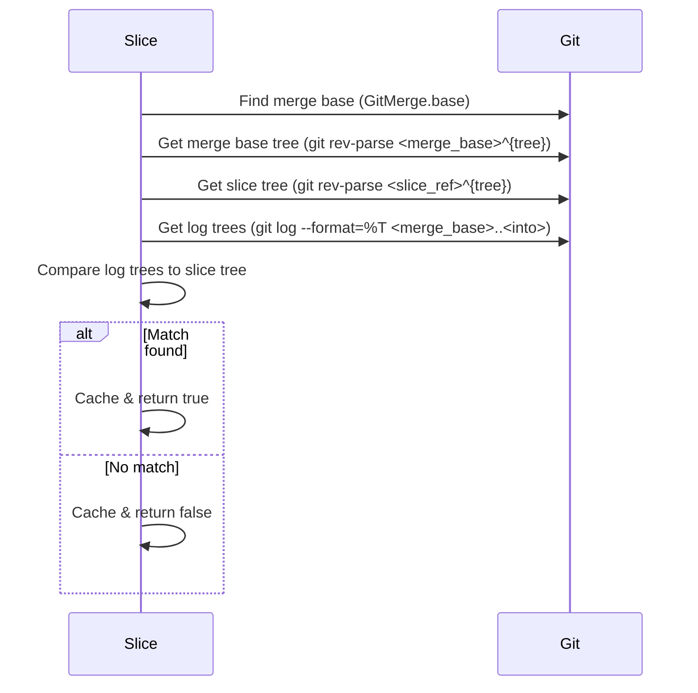

# `sparse update` command
## Merge Detection
The `isMerged` function in `slice.zig` determines whether the current slice (a Git branch reference) has been merged into another branch (`into`). It uses Git operations to compare commit trees and logs, caching results for efficiency.

### Step-by-Step Breakdown
1. **Check Cache**
   If the merge status for the target branch is already cached in `_is_merge_into_map`, return the cached result.
2. **Quick Object ID Check**
   If the object IDs (commit hashes) of the two branches are the same, return `false` (no merge check needed).
3. **Find Merge Base**
   Use `GitMerge.base` to find the common ancestor commit (merge base) between the current slice and the target branch.
4. **Get Trees for Comparison**
   - Use `git rev-parse` to get the tree hash of the merge base.
   - Use `git rev-parse` to get the tree hash of the current slice.
5. **Get Commit Trees in Target Branch**
   Use `git log --format=%T <merge_base>..<into>` to get all tree hashes in the target branch since the merge base.
6. **Compare Trees**
   - For each tree hash in the log, compare it to the slice’s tree hash.
   - If a match is found, the slice is considered merged. Cache and return `true`.
   - If no match is found, cache and return `false`.

### High-Level Overview

### Git Operations Sequence Diagram

